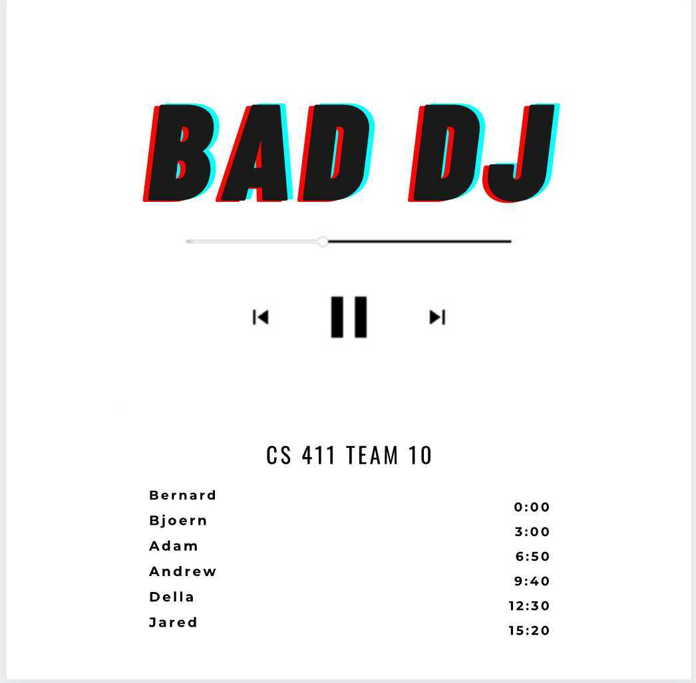
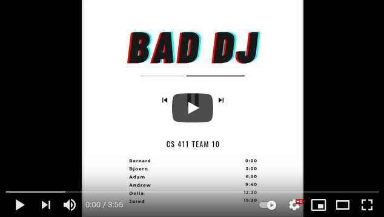

# 411 Project: Music Sharing Platform ­— BadDJ

## Members
* Bernard Mulaw
* Bjoern Hasemann
* Adam Clay
* Andrew Chung
* Della Lin
* Jared Whitney

## About
This is a music sharing space which users log into with Spotify.

Every person on this platform has some playlist that represents them on their
profile, and the app can suggest songs and other users with similar
preferences. People can also create conversations (like tweets with a
song/playlist/artist attached) to communicate with other users about
interests.

We use the Spotify API (https://developer.spotify.com/documentation/web-api/)
to get information about a person's genre/artist preferences to curate
appropriate user playlists. We use the last.fm API (https://www.last.fm/api) to
gather data about popular artists as it applies to people in general. The two
APIs work together in order to understand general trends in music taste, as
well as personal (single user) preferences.

## Notes
* Note that some functions may take a moment to load in. These include:
    * Friend recommendations. Remain on the Profile page while they load
    * Displaying notifications. Refreshing the page will update the visible list
    * Showing the song feed (Home tab) requires refreshes
* Documentation for the backend API can be found at `localhost:8080/documentation` once the
  backend server is running

## How to Run

In order to run BadDJ:
1. In `frontend/src/`, populate the `config.json` file with a Spotify client
   ID and client secret as well as a Last.fm client ID and client secret
2. Install dependency programs
    * MongoDB
    * `npm`
3. `cd` into `backend` and run `python app.py` for the backend server
4. In a second terminal,
    * `cd` into `frontend`
    * Run `npm install` to grab all `npm` dependencies 
    * `npm start` the frontend server
5. In a third terminal, start MongoDB with `mongod --dbpath <database_path>`
6. Open a web browser and navigate to `localhost:3000`
